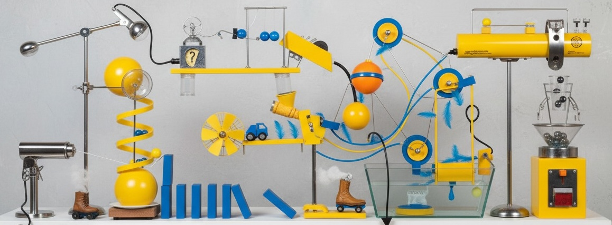

# Team Management Playbooks

## ✨ The Spark of Great Teams

The best teams I've been part of felt like a group of friends huddled in a garage, building something new.
Not polished. Not corporate. Just a whiteboard, a few laptops, and people tossing out ideas, sketching flows, laughing, and chasing that _"what if we tried this?"_ spark.

Looking back, the magic came from three things:

- **Belonging** → every idea got a fair shot.
- **Mastery** → puzzles stretched people and they learned from each other's strengths.
- **Purpose** → the problem being chased was actually worth the team's time.

Those ingredients make collaboration feel natural. Titles blur. Hats overlap. Everyone leans in.

The manager's role should be to protect that spark. To block and tackle against bureaucracy, keep the rhythm sustainable, and make sure curiosity lasts longer than one late-night push. When that happens, results follow: fewer dead ends, faster loops from idea to test to decision, and clearer trade-offs when choosing between speed and polish.

_Nostalgia for the garage is real, but the point isn't to recreate the past. Tools and pressures will always change. What matters is carrying the spark forward: people leaning in, curious, and proud to put their best foot forward. Playbooks are touchstones that keep that spark alive as everything else evolves._

---

## How to Make Garage Energy Repeatable

Garage mode has a spark that feels almost magical, but it doesn't have to be rare. Teams can work that way on purpose, even under deadlines or at scale.

- **Start with the real problem.** Who is it for, what hurts, and why it matters. Avoid skipping to half-baked solutions.
- **Explore fast.** Whiteboard ideas, riff together, and see what sticks.
- **Pressure-test.** Run promising ideas through gaps and edge cases. Kill weak ones quickly, sharpen the strong ones.
- **Build together.** Break work down, unblock each other fast, and avoid grind-in-a-corner isolation.
- **Protect the rhythm.** No box-check meetings. No status theater. Use the scorecard to name trade-offs: sometimes speed, sometimes polish. Clear choices, no hidden compromises.

When teams work this way, outcomes come naturally. At one company, this approach helped double online revenue by letting speed win in the right places. At another, it cut cloud costs by 80 percent by slowing down to fix what was breaking. These were not lucky breaks. They were deliberate trade-offs made visible and acted on.

---

## Playbooks & Guides

The habits above are simple in spirit, but they work best when they're easy to repeat. That's why I've captured them as playbooks: not rigid rules, but lightweight touchstones that help teams keep the spark alive whether they're three people in a room or hundreds spread across time zones.

- **[Vision & Roadmaps](/playbooks/01-vision-roadmaps.md)** → anchoring on the problem and purpose.
- **[Engineering Pitfalls & Fixes](/playbooks/02-engineering-pitfalls.md)** → patterns that cause slowdowns, and how to avoid them.
- **[Operating System](/playbooks/03-operating-system.md)** → scaffolding that scales without micromanaging.
- **[Scorecard System](/playbooks/04-scorecard-system.md)** → where trade-offs get named, tracked, and balanced.
- **[Hiring Playbook](/playbooks/05-hiring.md)** → finding people who thrive in this environment.
- **[1:1 Coaching Framework](/playbooks/06-1-1-coaching.md)** → keeping belonging and growth alive.
- **[Sprint Planning & Retros](/playbooks/07-sprint-planning-retros.md)** → dividing and conquering without losing flow.
- **[Onboarding Playbook](/playbooks/08-onboarding.md)** → helping new teammates plug into the vibe fast.
 - **[Strategy](/playbooks/09-strategy.md)** → one-line strategy with explicit tradeoffs that guide decisions.

---

## R&D and Experiments

Most of the tools I build start from necessity. A gap shows up, something slows us down, and the quickest way forward is to make something new. That necessity gives me an excuse to explore, learn, and sharpen skills. It's where I chase mastery, test ideas with purpose, and share back with the community.

- **[mgmt-boost](https://github.com/bmardock/mgmt-boost)** → AI Slack extension to lighten manager overhead. Built to see if small nudges could replace long status threads.
- **[analog-todo](https://github.com/bmardock/analog-todo)** → a paper-inspired task app ("Today / Next / Someday"). Exploring how simple structure changes user behavior.
- **[dash-cam](https://github.com/bmardock/dash-cam)** → a real-time Nest Cam dashboard. Testing how far live feeds and alerts could be pushed for operations.
- **[real-time-processing](https://github.com/bmardock/real-time-processing)** → instant sync across POS and e-commerce. Proved how fast systems could stay consistent under load.
- **[shop-helper-extension](https://github.com/bmardock/shop-helper-extension)** → Chrome workflows for ops pages. Experimenting with shortcuts that shaved minutes off repeated tasks.

Each project starts with a "what if" and ends with something learned. Sometimes it's a tool that sticks. Sometimes it's just a spark that makes its way into a playbook. Either way, it's part of the same loop: purpose, mastery, and belonging played out in code.

---

## Let's Connect

I like comparing playbooks, swapping stories, and building alongside people who care about solving the right problems. If any of this resonates, I'd love to connect.

- [LinkedIn](https://www.linkedin.com/in/brandonmardock/)
