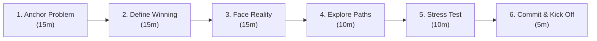

# 01 — Vision & Roadmaps

**When to pull this out**  
Before you write any code. When stakeholders are asking for features but can't explain the customer problem. When your last three "priorities" all shipped but didn't move the business metrics.

**Why it matters**  
The best products start with teams obsessed with customer problems, not feature checklists. This process transforms "what should we build?" into "what problem are we solving and how will we know we've won?" Teams that nail this build things customers love and competitors can't easily copy.

---

## Inputs (No handwaving allowed)
- **Direct customer voice:** Support tickets (last 30 days), user interviews (last quarter), usage analytics showing where people drop off
- **Team capacity:** Who's actually available (minus vacations, other projects, interview time)
- **Business constraints:** Real deadlines with consequences, budget limits, stakeholder non-negotiables
- **Tech reality:** What we can build on vs. what requires new infrastructure

**Gut check:** If you can't name 3 customers who asked for this, stop and get real data first.

**Dig deeper together:** Customer feedback often comes as feature requests, but the real innovation happens when you understand the underlying pain. Work with your PM to unpack what customers are really trying to accomplish.

---

## Core Process (90 minutes to unlock your next breakthrough)

*The goal isn't perfect planning—it's confident action. Great teams move fast because they're clear on what matters.*


### 1) Anchor on the Problem (15m)
*Start with empathy, end with clarity.*

- **Who** specifically has this problem? (name actual customer segments with data)
- **What** breaks in their current workflow? (specific steps, not vague "frustration")  
- **How much** does this cost them? (time, money, lost opportunities)
- **What happens** if we don't solve this? (they leave, don't upgrade, complain publicly)

**Unpack customer requests together:** When you hear "customers want feature X," dig deeper as a team:
- *"What are they trying to accomplish with X?"*
- *"What do they do instead when X doesn't exist?"*
- *"What would success look like from their perspective?"*

*Great products solve problems people care about enough to change their behavior.*

### 2) Define Winning (15m)
- Pick **1 leading metric** you can influence directly (usage, conversion, time-to-value)
- Pick **1 business metric** that proves impact (revenue, retention, NPS)
- Set **specific targets** with dates: X% improvement by [date], Y% by [date]
- Confirm **measurement exists** right now (if not, that's your first sprint)

**Story test:** Can you explain this in one sentence that your mom would understand?
- "We're making checkout faster so people don't give up buying things"
- "We're fixing search so customers find what they want in 3 clicks instead of 10"

### 3) Face Reality (15m)
- **Time:** Real deadline with consequences, or someone's arbitrary date?
- **Team:** Actual hours available (not theoretical capacity)
- **Tech:** Build on what exists, or 6+ months of new platform work?
- **Scope:** What's the absolute minimum that customers would actually pay for?

### 4) Explore Paths (10m)
- **Build vs. buy vs. partner**: What gets customers value fastest with least risk?
- **Quality vs. speed**: Where can we cut corners without breaking trust?
- **MVP vs. full solution**: What's the smallest version customers would actually use?

**Milestone storytelling:** Frame each phase as unlocking customer value:
- "Month 1: Customers can complete checkout without errors"
- "Month 2: Customers can save payment methods for faster repeat purchases"  
- "Month 3: Customers get personalized product recommendations during checkout"

### 5) Stress Test (10m)
- **What kills this project?** (specific technical risks, team dependencies, market changes)
- **What are we assuming** that we haven't validated?
- **If this takes 2x longer**, do we still do it or pivot?
- **Kill criteria:** At what point do we stop and try something else?

### 6) Commit & Kick Off (5m)
*Decision time. Clarity creates momentum.*

- **Choose the path** and document what we're NOT doing
- **Single owner** accountable for delivery (not a committee)  
- **First checkpoint** in 2 weeks with specific deliverable

*The magic happens when teams move from "we should probably..." to "we're definitely building this because..."*

---

## Avoid These Traps (Stay sharp, not scattered)
- **Solution-first planning:** "We need to build X" without understanding why customers would want it
- **Over-planning syndrome:** Trying to map out 12+ months when you should focus on the next meaningful milestone
- **Committee-driven vision:** Too many voices, no clear owner, decisions by consensus instead of conviction
- **Metrics theater:** Tracking impressive numbers that don't actually influence decisions or user value

## Staying on Track (Red flags vs. green lights)

**Vision Clarity Test:**
- Random team member can explain the customer problem in 30 seconds
- People say "this doesn't help [customer segment]" when cutting scope
- Features get rejected because they don't move the metric

**Decision Speed:**
- Days from stakeholder request to "yes/no/not now" decision
- How often you change direction based on actual user feedback (not opinions)

**Delivery Reality:**
- Your estimates vs. actual delivery (within 25% = good)
- Number of "urgent" priorities that turn out not to matter

---

## Sample Vision Framework

*Use this as a starting point, not a fill-in-the-blank exercise. The best visions feel inevitable once you hear them.*

**Problem Statement (Fill this out or don't start):**
```
[Customer segment] currently [specific broken process] which costs them 
[quantified time/money] and prevents [specific outcome they care about].
If we don't solve this: [customers leave/don't upgrade/complain/find alternative]
```

**Success Criteria (Concrete numbers):**
```
We'll know we're winning when:
- Leading metric: [usage behavior] changes by X% within [timeframe]
- Business metric: [revenue/retention/NPS] improves by Y% within [timeframe]  
- Customer validation: [specific feedback] from [specific segment]
- Kill criteria: If we don't see [leading metric] by [date], we stop
```

**Milestone Stories (For socializing progress):**
```
Milestone 1: "We're unlocking [customer capability] so they can [desired outcome]"
- Success story: [Specific customer scenario that works better]
- Evidence: [Metric that proves it's working]

Milestone 2: "We're expanding [customer capability] so they can [next level outcome]"  
- Success story: [How the experience gets even better]
- Evidence: [Metric that shows increased value]

Milestone 3: "We're optimizing [customer capability] so they can [ultimate outcome]"
- Success story: [The complete, polished experience]
- Evidence: [Metric that shows business impact]
```

*Use these stories when updating stakeholders, celebrating wins, and keeping the team connected to customer impact.*

**Remember:** The framework is a tool, not a script. Adapt the questions to your context. Skip steps that don't apply. Add steps that matter for your situation. The goal is clarity and commitment, not checkbox completion.

**Storytelling for stakeholders:** Every milestone should unlock a customer capability, not just complete technical tasks. "We shipped the API" becomes "Customers can now save their preferences." This makes progress visible and keeps everyone focused on value, not just delivery.

---

## Unpacking Customer Pain (Engineer + PM collaboration)

Customers often express pain as feature requests, but the magic happens when you understand what they're really trying to accomplish. Work together to dig deeper:

**When you hear:** "Customers are asking for feature X"  
**Explore together:** "What problem does X solve for them? What's their current workaround? Can we see the original feedback?"

**When you hear:** "This will improve user experience"  
**Get specific:** "Which user workflow breaks today? How do we measure improvement? What does 'better' look like?"

**When you hear:** "Customers are frustrated with Y"  
**Quantify the pain:** "What does frustrated mean exactly? How much time/money does this cost them? What do they do instead?"

**Great signs you're on the right track:**
- You can describe the customer's current workflow step-by-step
- You understand the cost of the problem (time, money, opportunities)
- Multiple solutions could address the underlying need
- You have specific metrics for success

**Get closer to the customer:** Join customer calls, read support tickets, or shadow sales demos. The best technical solutions come from engineers who understand customer context deeply.

**Leadership opportunity:** When requirements are unclear, this is your moment to drive customer clarity for the whole team. Champion the conversation - bring stakeholders together, facilitate discovery, and emerge with shared understanding. These moments of ambiguity are where leaders are made and teams get stronger.

**Manager partnership:** When team members step up to drive clarity beyond their role, managers should recognize this leadership, ensure it doesn't become an unfair burden, and use these moments to identify gaps in process or resourcing.

---

## References
- [Jobs to be Done framework](https://hbr.org/2016/09/know-your-customers-jobs-to-be-done)
- [Amazon PR/FAQ process](https://www.allthingsdistributed.com/2006/11/working_backwards.html)
- [Shape Up: Setting Boundaries](https://basecamp.com/shapeup/1.1-chapter-02)
