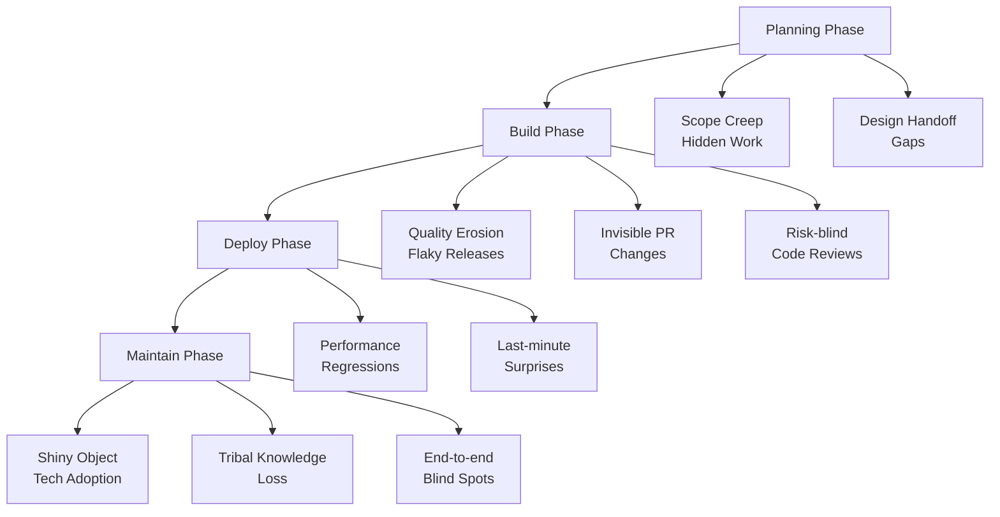

# 02 — Engineering Pitfalls & Fixes

## When to pull this out

When velocity is dragging, quality is slipping, or you're starting something new and want to avoid the usual traps. When you need to turn recurring frustrations into team strengths.

## Why it matters

Every engineering team hits the same predictable obstacles. The difference between good teams and great teams? Great teams spot these patterns early and turn them into opportunities to level up their game. Instead of getting blindsided by the same problems every quarter, you get ahead of them and build systems that make your daily work smoother.

---

## Inputs (Know where you stand)

- **Recent pain points:** What's been slowing you down or causing rework?
- **Team radar:** Current velocity trends and quality metrics
- **What's coming:** New projects, tech adoption, or team changes on the horizon
- **Skill gaps:** Where could the team use more experience or support?

_Honest assessment: Teams that acknowledge their weak spots get to fix them. Teams that pretend everything's fine keep hitting the same walls._

---

## The Pattern Recognition System (Spot trouble before it spots you)

_When you spot these patterns happening, it's your moment to step up and champion better practices for the team._

| Warning Sign                         | Leadership Opportunity                                                                                                                                                                         | Phase    |
| ------------------------------------ | ---------------------------------------------------------------------------------------------------------------------------------------------------------------------------------------------- | -------- |
| **Shiny‑object tech adoption**       | **Drive technical strategy:** Run a cost‑benefit spike, capture an ADR, and tie adoption to measurable business outcomes. Show the team how to evaluate tech decisions like a senior engineer. | Planning |
| **Scope creep & hidden work**        | **Protect team focus:** Flag "3‑point" stories as red flags - lead the effort to unpack into spikes or split tickets before sprint start. Champion realistic commitments.                      | Planning |
| **Design hand‑off gaps**             | **Build cross-functional clarity:** Lead pre‑implementation walkthroughs with PM, UX, QA, Lead Dev to clarify workflows & edge‑cases. Prevent confusion before it starts.                      | Planning |
| **Quality erosion & flaky releases** | **Champion sustainable velocity:** Drive adoption of feature flags, robust e2e test suite, and peer reviews baked into DoD. Make "done right" the team standard.                               | Build    |
| **Invisible PR changes**             | **Improve team efficiency:** Champion auto‑deploy PR preview environments so reviewers can click through features, not just read diffs. Make everyone's review process easier.                 | Build    |
| **Risk‑blind code reviews**          | **Level up code quality:** Lead effort to tag each PR with Low/Med/High risk so team focuses deep checks on high‑impact changes. Smart allocation of review time.                              | Build    |
| **End‑to‑end blind spots**           | **Protect user experience:** Advocate for workflow‑level e2e tests over micro‑unit tests to protect real user journeys. Think like your customers.                                             | Build    |
| **Last‑minute surprises**            | **Master proactive communication:** Implement Red/Yellow/Green Slack check‑ins before stand‑up to unblock problems fast. Surface issues before they become blockers.                           | Deploy   |
| **Performance regressions**          | **Drive technical excellence:** Define SLOs, instrument metrics, and champion tech‑debt grooming sessions during sprint planning. Make performance everyone's responsibility.                  | Deploy   |
| **Tribal knowledge loss**            | **Build institutional knowledge:** Lead the charge on ADRs, diagrams, and quarterly doc‑sprints that leave clear artifact trails. Make complexity accessible to future teammates.              | Maintain |

---

## Team Pattern Review (30 minutes quarterly - invest in getting ahead of problems)

_Great teams don't just react to problems, they prevent them._

### 1) Recent Reality Check (10 minutes)

_Get honest about what tripped you up._

- **What slowed us down:** Which specific patterns caused the most friction?
- **Blindspot audit:** What pitfalls caught us off guard?
- **New challenges:** What fresh obstacles emerged as we grew or changed?

### 2) Current Vulnerability Assessment (10 minutes)

_Know where you're exposed right now._

- **Risk radar:** Which pitfalls are we most vulnerable to today?
- **Change impact:** What's shifted in our team, tools, or projects that creates new risks?
- **Gap analysis:** Where do our current practices need strengthening?

### 3) Level-Up Strategy (10 minutes)

_Turn insights into action._

- **Practice evolution:** Which prevention tactics need adjustment based on what we learned?
- **New experiments:** What practices should we try that could make work smoother?
- **Success tracking:** How will we measure if our improvements are actually working?

_Goal: Leave with 1-2 concrete experiments that address your biggest current vulnerabilities._

---

## Avoid These Traps (Common prevention mistakes)

- **Pattern fatalism:** "We always struggle with X" - Frame recurring issues as solvable challenges, not permanent team weaknesses
- **Solution hoarding:** Building perfect tools that only you understand - Champion practices that the whole team can adopt and improve
- **Prevention theater:** Implementing processes that look good but don't address root causes - Focus on changes that actually reduce daily friction
- **Perfectionism paralysis:** Waiting for the ideal solution - Start with small experiments that teach you what works for your team
- **Hero complex:** Personally fixing every problem instead of building team capability - Use pitfalls as teaching moments that level up everyone

---

## Health Check (How to know this is working)

**Pattern recognition improves:**

- **Early warning success:** Team spots pitfalls before they cause major delays
- **Shared vocabulary:** Everyone can identify and name common problems quickly
- **Proactive discussions:** Pitfalls get surfaced in planning, not just retrospectives

**Prevention gets stronger:**

- **Experiment success rate:** New practices actually stick and improve daily work
- **Recovery speed:** When problems do occur, team bounces back faster
- **Frequency reduction:** Same pitfalls stop recurring quarter after quarter

**Team capability grows:**

- **Distributed ownership:** Multiple people can champion improvements, not just tech leads
- **Context sharing:** Solutions work for your team's specific constraints and culture
- **Teaching moments:** Setbacks become opportunities for the whole team to get better

_Track 2-3 patterns that are currently your biggest pain points and measure improvement over 6-month cycles._

## References

- [Operating System playbook](./03-operating-system.md) for process implementation
- [Sprint Planning playbook](./07-sprint-planning-retros.md) for incorporating prevention
- [Code review best practices](https://google.github.io/eng-practices/review/)
- [Technical debt management strategies](https://martinfowler.com/bliki/TechnicalDebt.html)

---

_Remember: Every pitfall is a pattern you can break. Every prevention strategy is a leadership opportunity. The best engineering teams don't avoid all problems - they get really good at turning problems into systems that prevent future problems._
