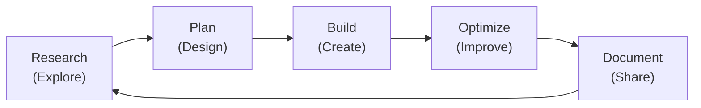

# 03 — Operating System for High‑Performing Engineering Teams

**When to pull this out**  
When your team is drowning in ad-hoc decisions and reactive work. When "urgent" always wins over "important." When you're shipping features but technical debt is piling up faster than you can pay it down.

**Why it matters**  
Great teams don't just ship fast—they ship fast consistently. This system creates sustainable rhythms where research, quality, and delivery all get attention instead of fighting for scraps of time.

---

## Inputs (What you need to start)
- **Team reality:** Size, experience levels, current workload and commitments
- **Tool landscape:** What you have vs. what actually works for your workflow
- **Delivery pressure:** Real expectations vs. wishful thinking from stakeholders
- **Quality bar:** Performance requirements that matter vs. perfectionist gold-plating

**Honest assessment:** If your team spends more time in "urgent" mode than planned work, start here.

---

## The Five Pillars (Balanced engineering excellence)

*Instead of lurching between "move fast and break things" and "measure twice, cut once," this system keeps all five areas healthy simultaneously.*

**Cross-functional growth:** When blockers appear, they're opportunities for everyone to expand their skills and impact. Engineers develop product thinking by clarifying requirements, PMs grow technical depth by understanding constraints, designers sharpen systems thinking with edge cases. Every challenge is a chance to become a more well-rounded contributor.

**Sustainable collaboration:** Managers should track when team members wear extra hats to ensure recognition, prevent burnout, and identify skill gaps that need permanent solutions. The goal is strategic help, not hidden heroics.



### Research (Explore)
**Purpose:** Turn uncertainty into informed decisions before they become expensive mistakes  

**What this looks like:**
- Spike/prototype risky technical decisions and document findings (ADRs)
- Share learnings: article summaries, conference takeaways, technology evaluations
- Create research tickets to de-risk large estimates
- Due-diligence checklist: maturity, cost, benefits, rollback plan
- Quarterly tech radar updates

**Reality check:** 10-15% of sprint capacity (not "when we have time")  
**Who drives it:** Senior engineers, rotating monthly

*Great teams research before they're stuck, not after.*

### Plan 📋
**Purpose:** Transform vague requests into concrete work that teams can actually deliver  

**What this looks like:**
- Story mapping and estimation that accounts for unknowns
- Every sprint includes research tickets, optimization work, and feature development
- Break down dependencies, identify blockers, define test criteria before starting
- Any "3-point" story gets decomposed into smaller, clearer pieces
- Each epic has a one-line success metric and explicit scope boundaries

**Collaborative problem-solving:** When ambiguity arises, it's a leadership opportunity for everyone to step beyond their role and contribute unique perspectives. Engineers can strengthen product intuition, PMs can deepen technical understanding, designers can influence system architecture. These moments build both individual skills and team cohesion.

**Manager oversight:** EMs should be aware when team members stretch beyond their primary role to ensure this cross-functional work gets recognized, doesn't create burnout, and helps identify where the team needs additional permanent capacity.

**Reality check:** 20% of sprint time (planning meetings + prep work)  
**Who drives it:** PM + tech lead partnership, but everyone steps up

*Good planning prevents heroic recovery efforts.*

### Build (Create)
**Purpose:** Ship features customers love without creating future maintenance nightmares  

**What this looks like:**
- Tackle dependencies first, push nice-to-haves to later iterations
- Coding standards and simplicity win over clever optimization
- Tests written first, critical PRs get pair reviews
- PR risk tagging (low/medium/high) with automated checklists and preview environments
- Tech debt tracked in backlog, surfaced during planning

**Reality check:** 60-65% of sprint capacity (the core work, but not everything)  
**Who drives it:** All engineers, with senior engineers coaching

*Great code is readable code that solves real problems.*

### Optimize (Improve)
**Purpose:** Keep the system fast and reliable as it grows  

**What this looks like:**
- Baseline performance before changes, measure impact after
- New features include monitoring and alerts from day one
- Build and deployment processes get regular attention for speed and reliability
- Tech debt review in every grooming session with dedicated sprint capacity
- Performance improvements documented and shared across teams

**Reality check:** 10-15% of sprint capacity (planned, not "if there's time")  
**Who drives it:** Infrastructure-focused engineers, rotating quarterly

*Performance is a feature, not an afterthought.*

### Document 📚
**Purpose:** Capture decisions and context so future you (and new teammates) aren't guessing  

**What this looks like:**
- Simple templates for consistency: purpose, summary, content, next steps
- ADRs and diagrams for major technical decisions
- Write for your audience: whatever format people actually read (GitHub, Confluence, slides)
- Documentation discussions in code reviews and team presentations
- New hire onboarding exposes and fixes documentation gaps

**Reality check:** 5-10% of sprint capacity (small but consistent)  
**Who drives it:** Whoever makes the decision documents it, team reviews

*Good documentation is a love letter to your future self.*

## Implementation (4-week ramp-up)

### Week 1: Audit & Assign
- **Time audit:** Track where effort actually goes vs. where it should go
- **Pillar ownership:** Assign someone accountable for each pillar (can rotate monthly)
- **Quick win:** Pick the most neglected pillar and add capacity for it in next sprint

### Week 2: Integrate Into Existing Rhythms
- **Sprint planning:** Add explicit capacity for research, optimization, and documentation
- **Standups:** Add pillar check-ins ("any research blockers? tech debt piling up?")
- **Tool setup:** ADR templates, tech debt tracking, whatever's missing

### Week 3: Measure & Adjust
- **Baseline metrics:** Start tracking the health indicators that matter
- **Retrospective addition:** Which pillars felt healthy? Which got squeezed by "urgent" work?
- **Process tweaks:** Adjust percentages based on team reality

### Week 4: Make It Stick
- **Team feedback:** Survey on what's working, what feels forced
- **Documentation:** Capture team agreements and pillar responsibilities
- **Share learnings:** Document what you learned for other teams

---

## Avoid These Traps (Keep the system alive, not bureaucratic)
- **Pillar silos:** Creating separate "research team" vs "ops team" instead of shared responsibility
- **Process theater:** More time in meetings about the work than doing the work
- **Documentation perfectionism:** Spending hours on docs that nobody reads instead of quick, useful context
- **Measurement without action:** Tracking everything, improving nothing
- **Research rabbit holes:** Endless spikes that never ship anything customers can use

## Staying Healthy (How to know the system is working)

**Process Health:**
- **Predictable delivery:** % of sprint commitments actually completed
- **Debt management:** Technical debt paid down vs. new debt created each sprint
- **Knowledge flow:** ADRs written, docs updated, learnings shared
- **Quality trends:** Bug rates, review speed, test coverage direction

**Team Reality Check:**
- **Sustainable pace:** Overtime hours, burnout signals, team satisfaction
- **Growth happening:** New skills, conference talks, cross-team mentoring
- **System effectiveness:** Team survey scores on each pillar

**Business Impact:**
- **Consistent shipping:** Features delivered per quarter (trending up or stable)
- **System reliability:** Uptime, performance, incident frequency
- **Customer value:** Feature adoption rates, user satisfaction scores

*The goal is progress, not perfection. Adjust the system when metrics trend in the wrong direction.*

**Remember:** This isn't about perfect adherence to percentages. It's about balanced attention across all the things that make teams effective long-term.

## Templates & Tools

**ADR Template:**
```
# ADR-XXX: [Brief Title]

## Status: [Proposed/Accepted/Deprecated]

## Context
What is the issue that we're seeing that is motivating this decision or change?

## Decision
What is the change that we're proposing and/or doing?

## Consequences
What becomes easier or more difficult to do because of this change?
```

**Tech Debt Ticket Template:**
```
**Problem:** What hurts today?
**Impact:** How does this slow us down?
**Effort:** T-shirt size (S/M/L/XL)
**Value:** What improves when this is fixed?
**Risks:** What could go wrong if we don't fix this?
```

**Sprint Capacity Planning:**
```
Research:    10-15% (spikes, ADRs, tech evaluation)
Planning:    20%    (story breakdown, estimation, coordination)
Building:    60-65% (feature development, code reviews, testing)
Optimization: 10-15% (performance, tech debt, infrastructure)
Documentation: 5-10%  (ADRs, onboarding docs, knowledge sharing)
```

---

## References
- [Engineering Pitfalls playbook](./02-engineering-pitfalls.md) for common failure modes
- [Sprint Planning playbook](./07-sprint-planning-retros.md) for incorporating these practices
- [Architecture Decision Records](https://adr.github.io/)
- [Google's Site Reliability Engineering](https://sre.google/sre-book/table-of-contents/)