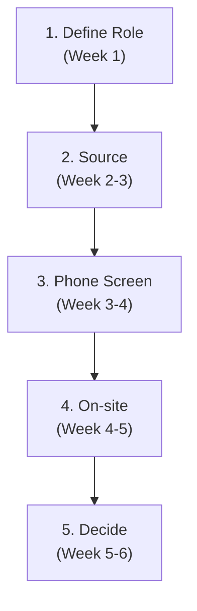

# 05 — Hiring Playbook

## When to pull this out

When you're ready to add someone to the team who will make everyone else better.

## Why it matters

Hiring is your most important multiplier. Get it right and you add energy and capability. Get it wrong and you spend months managing problems instead of building products.

---

## The Process (4-6 weeks)

### 1) Define Role

- **Impact focus:** What 3-4 problems will this person solve?
- **Victory conditions:** How will you know they're crushing it at 3, 6, 12 months?
- **Authentic positioning:** Share mission AND current challenges - you want people who can thrive in your current state, not just your ideal future

### 2) Phone Screen (30 minutes)

**Key questions:**

- "Tell me about a project you're particularly proud of"
- **"What does quality mean to you?"** (reveals maturity and values alignment)
- "What was the hardest technical problem you solved recently?"

**Listen for:** Depth of thinking, context awareness, team impact

### 3) On-site Interview

**The signals that matter:**

- **Mastery:** Deep understanding vs. surface knowledge
- **Curiosity:** Do they light up discussing challenges?
- **Collaboration:** How do they respond to feedback and explain ideas?

**Time discipline:** Don't let one strong area dominate - you need data on all dimensions

### 4) Decision Process

**Evaluation scorecard (rate 1-5):**

- Technical mastery
- Collaboration style
- Growth mindset
- Execution quality
- Cultural contribution

**Getting honest feedback:**

- **Instead of:** "Should we hire them?"
- **Ask:** "Would you be excited to mentor them into being highly productive?"
- **Red flag check:** Any scores of 2 or below?

---

## Key Insights

**Balance speed vs. quality:**

- Respect their time, but remember: bad hires are more expensive than taking time to find the right person
- If strong candidates aren't engaging, examine your employer attractiveness

**Take-home work (if used):**

- 2-3 hours max, realistic problem
- **Commit to reviewing it:** If you ask for their time, respect it by actually reviewing their work thoroughly
- The walkthrough and feedback response tells you more than the code itself

**Authentic positioning examples:**

- **Good:** "We're building X, but our current codebase has technical debt we're actively addressing"
- **Bad:** "We have the best culture and cutting-edge everything"

---

## Quick Checklist

**Before starting:**

- [ ] Define success criteria using scorecard
- [ ] Prepare specific examples of current challenges

**During process:**

- [ ] Use evaluation scorecard for every candidate
- [ ] Ask: "Would this person level up our team?"
- [ ] Check references with people who actually worked with them

**Red flags:**

- [ ] Can't give specific examples about past work
- [ ] Doesn't ask thoughtful questions
- [ ] Defensive when given feedback
- [ ] Team rates them inconsistently

---

_Remember: Find people who are genuinely excited about the problems you're solving and how you solve them together._
