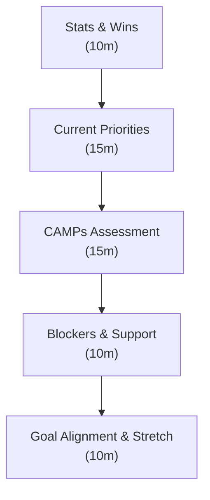

# 06 — 1:1 Coaching Framework

## When to pull this out

Regular cadence with each direct report—but adjust frequency based on what they need. When you want to move beyond status updates to actual development conversations that drive performance and engagement.

## Why it matters

Great managers notice when someone's energy shifts, when they light up talking about certain projects, when they're stuck but won't say it. The CAMPs framework gives you a structure, but the magic happens when you read between the lines and connect as humans, not just manager-employee.

---

## Inputs (Come prepared)

- **Previous 1:1 notes:** Action items, commitments, ongoing themes
- **Current context:** Recent work, team dynamics, organizational changes
- **Performance data:** Goal progress, recent feedback, growth opportunities
- **CAMPs assessment:** Where they stand on coaching, autonomy, mastery, purpose, safety

**Manager prep:** 15 minutes before each 1:1 reviewing notes and context. Show up present, not reactive.

**Read the room:** The framework is your guide, not your script. If they seem off, spend time there. If they're excited about something, follow that energy. The best 1:1s feel like conversations, not interviews.

**Adjust the cadence:** Bi-weekly is the default, but increase frequency when you see slips, new roles, or high-stress periods. Decrease when they're cruising and don't need as much support. Match the rhythm to their needs, not your calendar convenience.

---

## Core Structure (45-60 minutes using CAMPs framework)



_This isn't a status meeting—it's a development conversation with concrete outcomes._

### 1) Stats & Wins (10 minutes)

_Start with progress and energy._

**Quarterly Goals Check:**

- Where are you against your Q goals? (brief status, not deep dive)
- What's tracking well? What needs attention?

**Recent Wins:**

- What are you proud of since our last 1:1?
- Any breakthrough moments or learning highlights?

### 2) Current Priorities (15 minutes)

_What's taking their time and mental energy._

**This week/sprint focus:**

- What are your top 3 priorities right now?
- Where are you spending most of your time?
- Any competing priorities creating tension?

**Project/Work Quality:**

- What work are you most excited about?
- Anything feeling routine or energy-draining?

### 3) CAMPs Assessment (15 minutes)

_The heart of development conversation - but read their energy, don't just collect numbers._

**Start with what you notice:** "You seemed energized when talking about the API project yesterday" or "I sensed some frustration in the planning meeting - want to dig into that?"

**Then use CAMPs as a lens:**

- **Coaching:** Do you feel supported in growing? What kind of development would excite you?
- **Autonomy:** How much control do you have over your work? Where do you want more ownership?
- **Mastery:** Are you learning things that challenge you? What would stretch you in a good way?
- **Purpose:** How connected do you feel to the impact of your work? What makes this meaningful for you?
- **Safety:** How comfortable are you taking risks or sharing honest feedback with me?

_Skip the 1-10 scoring if the conversation is flowing naturally. The numbers are diagnostic tools, not the goal._

### 4) Blockers & Support (10 minutes)

_Remove friction, provide resources._

**Current Blockers:**

- What's slowing you down or creating frustration?
- Any decisions you're waiting on?
- People or resources you need access to?

**Manager Support:**

- How can I better support you?
- Any feedback on my leadership style or communication?

### 5) Goal Alignment & Stretch (10 minutes)

_Future-focused development - help them see possibilities they might not see._

**Dream a little:**

- What kind of work would you do if you could design your ideal role?
- What would you regret not trying while you're here?
- What would make you excited to wake up and work on Monday morning?

**Connect dots they might miss:**

- Here's what I see as your unique strengths...
- Based on what you're telling me, have you considered...?
- What if we found a way for you to [use their interest] in your current role?

**Make it real:**

- What's one small experiment we could try next month?
- Who should you be learning from or connected to?
- What would have to happen for this to become reality?

**Commit together:**

- Specific next steps with timelines
- Resources or connections I'll provide
- How we'll check progress

---

## Reading Between the Lines (What to watch for)

**Energy signals:**

- Do they light up when talking about certain projects or people?
- What makes them lean forward vs. zone out?
- When do they use "we" vs. "I" vs. "they"?

**Stress signals:**

- Talking faster or shorter answers than usual?
- Mentioning feeling "behind" or "not enough time"?
- Avoiding eye contact or seeming distracted?

**Growth signals:**

- Asking questions about other teams or roles?
- Sharing ideas or suggestions unprompted?
- Mentioning skills they want to develop?

**Disconnect signals:**

- Can't explain why their work matters?
- Complaining about processes without suggesting solutions?
- Seems to be going through the motions?

## CAMPs Deep-Dive Questions

**When Coaching score is low (< 7):**

- "What kind of development support would be most valuable right now?"
- "How do you prefer to receive feedback and guidance?"
- "What's one area where you'd like more coaching or mentoring?"

**When Autonomy score is low (< 7):**

- "Where do you feel micromanaged or constrained?"
- "What decisions would you like more control over?"
- "How can we increase your ownership of outcomes?"
- "Are you taking on work outside your role that should be recognized or redistributed?"

**When Mastery score is low (< 7):**

- "What skills do you want to develop next?"
- "Are you feeling under-challenged or over-challenged right now?"
- "What would stretch you in a good way?"

**When Purpose score is low (< 7):**

- "How does your work connect to customer impact?"
- "What part of your role feels most meaningful?"
- "What would make your work feel more purposeful?"

**When Safety score is low (< 7):**

- "What would make you feel more comfortable sharing honest feedback?"
- "Where do you feel like you can't take risks or make mistakes?"
- "How can we create more psychological safety on the team?"

---

## Avoid These Traps (Keep 1:1s human, not robotic)

- **Status report syndrome:** Reviewing task progress instead of understanding the person behind the work
- **Framework robotics:** Rigidly following the CAMPs questions instead of reading the room and following energy
- **Solution jumping:** Immediately fixing problems instead of helping them discover solutions
- **Schedule disrespect:** Constantly canceling shows they're not truly a priority
- **Surface-level listening:** Hearing words but missing emotions, energy, and what they're not saying

## Tracking Success (How to know this is working)

**Process Health:**

- **Consistency:** % of 1:1s held as scheduled (target: >90%)
- **Engagement:** Team satisfaction on feeling heard and developed
- **Action follow-through:** % of manager commitments delivered on time

**Development Impact:**

- **CAMPs trends:** Average scores improving over time (track quarterly)
- **Growth activity:** % of team members with active development goals
- **Career progression:** Internal promotions, skill development, new responsibilities

**Team Outcomes:**

- **Retention:** Voluntary turnover (especially high performers)
- **Performance:** Team performance ratings and goal achievement
- **Feedback quality:** Exit interview feedback about manager support

---

## Sample 1:1 Notes Template

```text
[Team Member Name] - [Date]

Energy Check: Seemed excited about the new API project, but frustrated with the deployment process

CAMPs Themes:
- Mastery: Craving more technical challenge, interested in system design
- Autonomy: Wants more ownership of the feature end-to-end
- Purpose: Really lights up when talking about customer impact
- Safety: Still hesitant to push back on unrealistic timelines

Key Insights:
- Ready for more complex technical work
- Values customer connection - should join customer calls
- Needs confidence boost on technical leadership

Actions:
- Connect with Sarah (senior eng) for system design mentoring (this week)
- Add to next customer demo session (next sprint)
- Give ownership of next medium-complexity feature (discuss with PM)
- Check in on timeline pushback comfort in 2 weeks
```

_Notice: Focus on insights and energy, not just scores. The goal is understanding the person, not optimizing metrics._

---

## Cadence Guidelines (Match support to need)

**Weekly (High-touch periods):**

- **New team members:** First 90 days or until they're confidently contributing
- **New role/responsibilities:** Promotion, role change, or significant new challenges
- **Performance slips:** Missing goals, quality issues, or engagement drops
- **High-stress periods:** Major projects, organizational changes, personal challenges
- **High-growth moments:** Stretching into new areas, leading initiatives

**Bi-weekly (Steady state):**

- **Experienced team members** performing well in established roles
- **Stable periods** with predictable work and clear expectations
- **Strong self-direction** - they surface issues proactively

**Monthly (Low-touch):**

- **Senior team members** who prefer autonomy and minimal check-ins
- **Temporary arrangement** when either of you has bandwidth constraints
- **Never permanent** - even strong performers benefit from regular connection

**When to shift frequency:**

- **Up the cadence** if you notice energy drops, missed commitments, or withdrawal
- **Down the cadence** when they're consistently hitting goals and seem energized
- **Ask them directly:** "How often would be most helpful for you right now?"

_Remember: Frequency changes should feel like support, not punishment or micromanagement._

## References

- [The Manager's Path by Camille Fournier](https://www.oreilly.com/library/view/the-managers-path/9781491973882/)
- [High Output Management by Andy Grove](https://www.amazon.com/High-Output-Management-Andrew-Grove/dp/0679762884)
- [Radical Candor 1:1 guide](https://www.radicalcandor.com/our-approach/)
