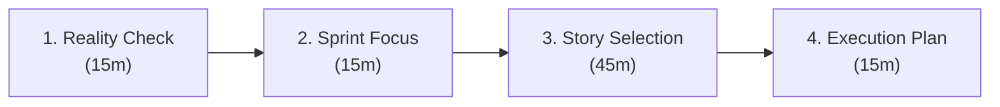
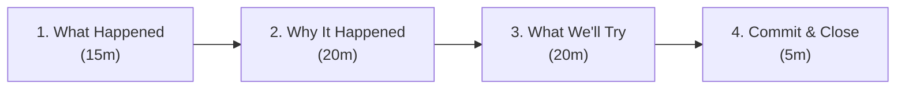

# 07 — Sprint Planning & Retros

**When to pull this out**  
Every 1-2 weeks when you want to turn scattered ideas into focused action. When you're ready to cut through estimation theater and build something that actually matters to customers.

**Why it matters**  
Most teams burn time in planning meetings that feel like homework and retros that feel like therapy sessions. But when you nail these rituals, magic happens - everyone knows exactly what victory looks like, feels ownership over the outcome, and gets energized by the progress they're making. Great teams use sprints to build momentum, not just check boxes.

---

## Inputs (Come prepared or waste everyone's time)

- **Prioritized backlog:** Stories actually ready for development (acceptance criteria, designs, dependencies clear)
- **Real capacity:** Actual availability minus meetings, support, vacation, interviews
- **Previous commitments:** Outstanding action items from last retro that actually matter
- **Technical reality:** Debt, maintenance, and platform work that can't be ignored

**Pre-planning:** PM and tech lead should spend 30 minutes before planning reviewing stories and flagging problems. No surprises in the room.

---

## Sprint Planning (90-120 minutes: decisions, not discussions)

**Note:** First few sprints will take longer as team learns the process - that's normal



_Goal: Leave with clear commitments everyone believes in, not a list of hopeful guesses._

### 1) Reality Check (15 minutes)

_Ground yourself in what actually happened, then aim higher._

**Last sprint honesty:**

- What % of committed work actually got done?
- What killed our momentum? (meetings, scope creep, technical surprises)
- Any carry-over work? Why didn't it finish?

**Retro integration check:**

- What experiment from last retro are we continuing/stopping?
- What successful practices do we need to protect this sprint?
- What early warning signs should we watch for based on last sprint's problems?

**This sprint capacity:**

- Who's actually available? (vacation, interviews, support rotation)
- Any known interruptions or dependencies?
- What's our realistic velocity based on recent sprints?

### 2) Sprint Focus (15 minutes)

_One mission that gets everyone fired up._

**Sprint mission:** What customer problem are we crushing?

- "We're fixing the checkout flow so customers don't abandon carts"
- "We're speeding up search so people find what they need"
- NOT "We're doing tickets 123, 124, 125"

**Victory looks like:** How will we know we're winning?

- Customer behavior changes: "Cart abandonment drops 15%"
- User feedback shifts: "Support tickets about search decrease"
- Team energy: "We can demo this and feel proud of what we built"

_If you can't connect the sprint to customer value, why are you building it?_

**When the work genuinely isn't customer-facing:**

- "We're reducing tech debt so the team can move faster on customer features"
- "We're improving monitoring so we catch customer issues before they do"
- "We're updating dependencies so we don't have security vulnerabilities"
- Be honest about maintenance work - it's necessary, just frame the business value

### 3) Story Selection (45 minutes)

_Pick battles we can win and feel great about._

**For each story, quick checks:**

- **Ready?** Acceptance criteria clear, designs available, dependencies resolved
- **Sized right?** Confident in estimate, or need to break it down further
- **Testable?** Clear plan for verification
- **Worth it?** Connects to sprint goal

**Leadership moments:** When something's unclear, this is your chance to step up and drive clarity for the team.

- Unclear requirements? Lead the charge - grab PM and customer data, facilitate the conversation
- Missing designs? Rally the team to sketch solutions, bring in designer expertise, keep momentum
- Technical unknowns? Own the research - spike it during planning or champion Day 1 investigation

**Capacity reality check:**

- Start with what you actually shipped last sprint (not what you hoped for)
- Subtract 20% for the inevitable interruptions and surprises
- Ask: "Would we bet $1000 we can finish this?" If no, cut scope
- Include tech debt and maintenance - they're investments in future speed

**Confidence test:** Everyone rates confidence 1-10. If average is below 7, cut work until it's 8+.

**When you can't cut scope:**

- Be honest about the risk and which stories might slip
- Plan for mid-sprint adjustment conversations

**Stop when:** The team genuinely believes they can deliver the sprint goal

### 4) Execution Plan (15 minutes)

_Sequence work to avoid blocking._

**Story sequencing:**

- Dependencies first (APIs before UIs, data before displays)
- High-risk work early (so there's time to recover)
- Pair/review needs identified upfront

**Commitment check:**

- Does everyone believe this is achievable?
- Any concerns or missing pieces?
- Who's accountable for each story?

---

## Retrospective (60 minutes: turn friction into fuel for improvement)



_Goal: Walk away with experiments that will make your daily work more satisfying and effective._

### 1) What Happened (15 minutes)

_Get the facts straight, then dig into what it felt like._

**Sprint outcomes:**

- Stories completed vs. committed
- What got blocked, delayed, or cut?
- Unexpected work that came up
- Time spent on meetings, support, learning

**Energy check:**

- What felt smooth and energizing?
- What felt frustrating or draining?
- When did the team feel most/least effective?

### 2) Why It Happened (20 minutes)

_Dig for root causes, not surface symptoms._

**Pattern hunting:**

- **Keep doing:** What specific behaviors helped us succeed?
- **Stop doing:** What consistently slowed us down?
- **Start trying:** What could we experiment with?

**Focus on systems, not people:**

- Process gaps (unclear requirements, late design changes, handoff problems)
- Technical friction (slow tests, deployment problems, tech debt slowing us down)
- Communication breakdowns (missing context, late decisions, unclear priorities)
- External blockers (waiting on other teams, tools, access, approvals)

**Energy drains vs. energy sources:**

- What made work feel like a slog vs. what made it feel engaging?
- When did we feel most/least connected to customer impact?

### 3) What We'll Try (20 minutes)

_Transform frustrations into experiments that could make work more enjoyable._

**Identify experiment candidates (10 minutes):**

- **For each major problem:** "What's the smallest change we could try to test if this helps?"
- **For each success:** "How could we make this happen more consistently?"
- **Team brainstorm:** What process tweaks have we been curious about?
- **External inspiration:** What have other teams tried that might work here?

**Examples of experiment types:**

- **Communication:** Async standups, Slack threads vs meetings, documentation standards
- **Focus:** No-meeting blocks, notification policies, deep work scheduling
- **Planning:** Story sizing methods, definition of done changes, dependency tracking
- **Code quality:** Review processes, testing approaches, technical debt allocation
- **Team dynamics:** Pair programming trials, cross-team collaboration, learning time

**Choose 1-2 experiments max:**

- **Specific change:** What exactly will we do differently?
- **Success criteria:** How will we know if it worked?
- **Owner:** Who's responsible for making it happen?
- **Timeline:** When will we check if it's working?

**Kill old experiments:**

- Review previous retro action items
- Keep what's working, stop what isn't
- Don't accumulate endless improvement backlog

**Experiments are internal problem-solving:**

- Pick changes that solve actual team friction, not what sounds impressive
- Failed experiments teach you what doesn't work - that's valuable data
- Focus on process improvements that make your daily work smoother

### 4) Sprint Integration (10 minutes)

_Bridge retro insights into next sprint execution._

**Carry forward the wins:**

- What specific practices made last sprint successful?
- How do we bake these into our next sprint rituals?
- Who will champion these successful patterns?

**Prevent the problems:**

- What early warning signs should we watch for?
- What guardrails can we put in place during planning?
- How will we course-correct mid-sprint if we see the same issues?

**Concrete commitments:**

- Add retro experiment as a sprint backlog item with clear owner
- Update team working agreements based on what we learned
- Schedule mid-sprint check-in if experiment needs adjustment
- Block calendar time for practices that worked well

### 5) Commit & Close (5 minutes)

_End with energy and shared ownership._

**Motivation check:**

- "What are you most excited to work on this sprint?" (If nothing, explore why)
- "What will feel amazing to ship to customers?"
- Call out specific wins and learning moments from last sprint

**When energy is genuinely low:**

- Acknowledge boring but necessary work honestly
- Connect maintenance tasks to future capability
- Focus on learning opportunities in unglamorous work
- Don't force fake enthusiasm - authenticity builds trust

**Team commitment:**

- "Are we confident we can hit our sprint goal?"
- Confirm experiment owners and check-in dates
- "What success will we celebrate in two weeks?"

_Leave the room with energy, not just a task list._

**The best retros change how the next sprint actually runs, not just how we feel about the last one.**

## Sprint Cadence Templates

**2-Week Sprint Schedule:**

- **Monday Week 1:** Sprint Planning
- **Friday Week 1:** Mid-sprint check-in (informal)
- **Thursday Week 2:** Sprint Review/Demo
- **Friday Week 2:** Retrospective + next sprint prep

**1-Week Sprint Schedule:**

- **Monday:** Sprint Planning (45 minutes)
- **Wednesday:** Mid-week sync (15 minutes)
- **Friday:** Review + Retro (45 minutes)

---

## Avoid These Traps (Keep rituals useful, not wasteful)

**Planning pitfalls:**

- **Estimation theater:** Spending hours debating 1 vs. 2 vs. 3 points instead of focusing on what's ready
- **Over-commitment syndrome:** Taking on too much, then cutting scope mid-sprint
- **Feature factory planning:** No capacity for tech debt, refactoring, or learning
- **Unprepared planning:** Reviewing unclear stories for the first time in the meeting

**Retro pitfalls:**

- **Blame-focused discussions:** "Who messed up" instead of "what can we improve"
- **Action item accumulation:** Starting new experiments before finishing previous ones
- **Complaint sessions:** Identifying problems but never trying solutions
- **Same problems, different sprint:** Talking about the same issues without changing anything

## Health Check (Track these to know it's working)

**Planning gets better over time:**

- **Commitment accuracy:** % of committed work actually completed (track monthly trend)
- **Planning time:** Meeting duration decreases as team gets better at it
- **Rework rate:** Stories that need significant changes after planning (should decrease)
- **Confidence calibration:** How often team confidence matches actual delivery

**Retros drive real change:**

- **Experiment follow-through:** % of experiments actually tried for full timeline
- **Problem elimination:** Issues that stop recurring after experiments
- **Process evolution:** Concrete changes to how team works (visible, measurable)
- **Cycle time improvement:** Measurable reduction in story completion time

**Team effectiveness improves:**

- **Flow efficiency:** % of time stories are actively worked vs. waiting
- **Context switching:** Reduction in mid-sprint scope changes
- **Knowledge sharing:** Fewer single points of failure on stories
- **Delivery predictability:** Stakeholders can rely on sprint commitments

**Note:** Track 2-3 metrics that matter most to your team's current pain points

## Templates & Tools

**Sprint Planning Prep Checklist:**

```text
Pre-planning (PM + Tech Lead, 30 minutes):
- [ ] Stories have clear acceptance criteria
- [ ] Designs are available and reviewed
- [ ] Dependencies identified and resolved
- [ ] Estimates feel confident
- [ ] Team capacity calculated (actual availability)
- [ ] Previous retro experiments reviewed
```

**Story Readiness Check:**

```text
- [ ] User story explains the "why" not just the "what"
- [ ] Acceptance criteria are testable
- [ ] Designs exist and are approved
- [ ] Dependencies are resolved or flagged
- [ ] Estimate reflects actual complexity
- [ ] Definition of done is clear
```

**Sprint Commitment Template:**

```text
Sprint Goal: [One sentence describing main outcome]

Committed Stories:
- Story A (3 pts) - [Owner] - [Key risk/dependency]
- Story B (5 pts) - [Owner] - [Key risk/dependency]

Capacity:
- Total points committed: XX
- Team confidence level: X/10
- Buffer included: XX% for unknowns

Key Risks:
- Risk 1: [Mitigation plan]
- Risk 2: [Mitigation plan]
```

**Experiment Discovery Framework:**

```text
Problem: [What's frustrating us?]
Root cause hypothesis: [Why do we think this happens?]
Smallest test: [What's the minimal change to test our hypothesis?]
Success signal: [What would we see if this worked?]
Failure signal: [What would tell us to stop this experiment?]
Timeline: [How long to test this?]
Owner: [Who's driving this?]
```

**Retro Experiment Template:**

```text
Experiment: [Specific change we'll try]
Why: [Problem this addresses]
How we'll know it worked: [Success criteria]
Timeline: [When we'll check results]
Owner: [Who's responsible]
```

**Common Experiment Categories:**

```text
COMMUNICATION
- Meeting format changes (async, shorter, different cadence)
- Documentation standards (templates, review processes)
- Notification policies (when to interrupt vs. async)

FOCUS & FLOW
- Protected deep work time (no-meeting blocks)
- Context switching limits (batching similar work)
- Environment changes (work from home policies, office setup)

PLANNING & PROCESS
- Story estimation methods (t-shirt sizing vs. points)
- Definition of done adjustments
- Dependency tracking improvements

TECHNICAL PRACTICES
- Code review approaches (pair vs. async review)
- Testing strategies (when to write tests, coverage targets)
- Technical debt allocation (% of sprint capacity)

TEAM DYNAMICS
- Collaboration experiments (pair programming, mob sessions)
- Knowledge sharing (brown bags, documentation)
- Cross-team interaction (embedded vs. liaison model)
```

---

## Garage Mode Checklist (Keep the energy alive)

**Planning energy check:**

- [ ] Everyone can explain the sprint goal in one sentence
- [ ] Team is genuinely excited about at least one thing they're building
- [ ] Sprint connects to real customer problems, not just internal requests
- [ ] Confidence level is 8+ (would bet money we can deliver this)
- [ ] No one feels overwhelmed or set up to fail

**Retro energy check:**

- [ ] We're talking about solutions, not just complaints
- [ ] Team feels empowered to change things that frustrate them
- [ ] We're celebrating progress and learning, not just finding problems
- [ ] Experiments are things the team wants to try, not manager mandates
- [ ] People leave feeling energized about next sprint

**Leadership growth opportunities:**

- Transform feature lists into compelling customer missions that energize the team
- Help the team find excitement and ownership in their work commitments
- Turn complaints into constructive problem-solving sessions that build team confidence
- Champion experiments that actually solve recurring problems
- Step up to solve ambiguity when others might hesitate
- Expand your impact beyond your role boundaries to help the team succeed

**Growth mindset in action:**

- "That's unclear" becomes "This is my chance to drive clarity for everyone"
- "I need clearer requirements" becomes "I can lead the conversation to nail this down"
- "That's not in my role" becomes "What expertise can I contribute to help us ship?"
- Every problem is a chance to demonstrate leadership and grow the team's capabilities

**Smart collaboration (not hero mode):**

- When stepping outside your role, communicate with your manager about the extra capacity
- Make cross-functional help visible so it gets recognized and doesn't create burnout
- Focus on unblocking the team, not taking on everyone else's full workload
- Time-box extra efforts - contribute expertise without becoming the permanent owner

_Remember: The best sprints feel like a team choosing to build something meaningful together. Everyone leaves energized about what they're creating and confident they can deliver it._

---

## References

- [Scrum Guide](https://scrumguides.org/scrum-guide.html)
- [Spotify agile model](https://blog.crisp.se/wp-content/uploads/2012/11/SpotifyScaling.pdf)
- [Retrospective exercises](https://www.atlassian.com/team-playbook/plays/retrospective)
