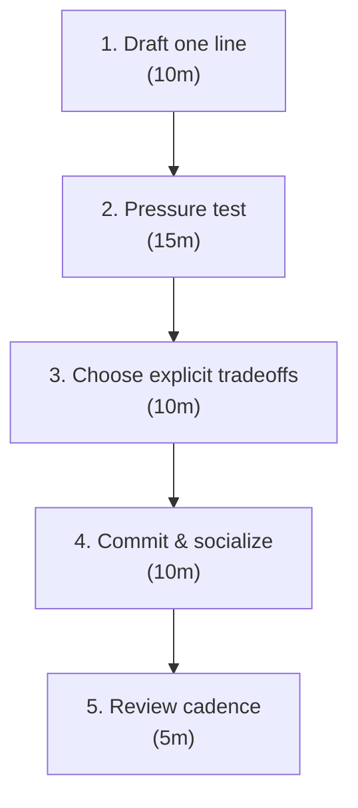

# 09 — Strategy

## When to pull this out

When priorities feel like a wishlist, roadmaps look like calendars, or decisions stall because “it depends.” Use this when you need a clear, shared choice that tells the team what to do—and what not to do—for the next quarter.

## Why it matters

Strategy is the shortest, clearest way to win. A real strategy is a one‑liner that makes tradeoffs explicit so people can act without more meetings. If it doesn’t help you choose what not to do, it’s not strategy.

---

## Inputs (What you need to start)

- **Context snapshot:** What changed in customers, competition, or constraints
- **Win condition:** The single outcome that defines winning this quarter
- **Non‑negotiables:** Guardrails you will not cross (compliance, runway, SLAs)
- **Tradeoff candidates:** The plausible things you might give up (speed, breadth, polish)
- **Decision maker(s):** Who writes and owns the line

_Clarity in → clarity out. Weak inputs create vague strategies._

---

## The Process (45–60 minutes total)

### 1) Draft one line (10m)

_Write it so a new hire could act on it without asking for a deck._

- Use: **We will [approach] in order to [win condition], even though it means [tradeoff].**
- If you can’t fill the tradeoff, you don’t have a strategy.
- Example: “We will bias toward completeness to raise sell‑through, even though it slows intake.”

### 2) Pressure test (15m)

_If it doesn’t force a choice, it’s a slogan._

- Would two people facing a hard call make the same decision?
- Does it name a real tradeoff (speed vs quality, focus vs breadth)?
- Could a new hire execute from this, today?

### 3) Choose explicit tradeoffs (10m)

_Name the loss so the team can stop relitigating it._

- List 2–3 things you will not do because of this strategy
- Capture “kill criteria” for reversing the choice (what would change your mind)
- Write the anti‑goals: “We are NOT optimizing for X this quarter”

### 4) Commit & socialize (10m)

_Strategy doesn’t exist until people repeat it back to you._

- Single owner writes the final line and posts it in team spaces
- Repeat it in standups, planning, and reviews until people can quote it
- Attach it to roadmap decisions: show what you did not do and why

### 5) Review cadence (5m)

_Context moves. Strategy should, too._

- Reaffirm or rewrite every 3 months
- If it still helps you choose, keep it; if not, change it

---

## Avoid These Traps (Common failure modes)

- **Inspiration theater:** Motivational lines that don’t kill options
- **Multi‑paragraph “strategies”:** If it doesn’t fit on one line, it won’t guide decisions
- **Hidden tradeoffs:** Teams keep debating because losses weren’t named
- **Committee authorship:** No owner = no accountability
- **Stale context:** Strategy older than 6 months without a check‑in

---

## Health Check (How to know this is working)

**Decision speed improves:**

- Fewer escalations; more same‑day calls made by ICs
- Clear yes/no/not‑now on roadmap items tied back to the line

**Consistency increases:**

- Two people make the same call from the statement
- New hires act correctly without extra context

**Focus holds:**

- You can list 2–3 anti‑goals you said no to this quarter
- Strategy is quoted in planning without you in the room

_Track 2–3 of these signals for the quarter you’re operating in._

---

## Strategy Test Card (Use as a template)

**Strategy Statement**

We will [approach] in order to [win condition], even though it means [tradeoff].

**Pressure Test**

- [ ] Names a real tradeoff (what we won’t do)
- [ ] Two people would make the same decision from it
- [ ] A new hire could act without more context
- [ ] Reviewed in the last 3 months

**Pass/Fail**

- If any box is unchecked → it’s not strategy yet

---

## References

- [01 — Vision & Roadmaps](./01-vision-roadmaps.md)
- [03 — Operating System](./03-operating-system.md)
