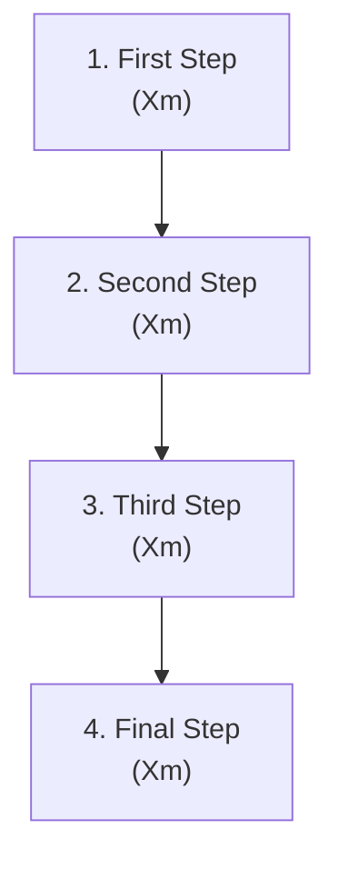

# {Number} — {Playbook Title}

## When to pull this out

Clear trigger conditions for when this playbook applies and what problem it solves.

## Why it matters

The impact of getting this right vs wrong. Connect to team energy, customer value, or business outcomes.

---

## Inputs (What you need to start)

- **Stakeholder readiness:** Who needs to be involved and available
- **Information gathered:** Required data, research, or context
- **Resources ready:** Tools, budget, or time commitment needed
- **Team capacity:** Realistic assessment of bandwidth and skills

_Clear expectations prevent wasted time and false starts._

---

## The Process (X-Y hours total)

### 1) Kickoff (X minutes)

_Set the stage for productive work._

- **Align on outcome:** What does success look like?
- **Confirm participants:** Who needs to be here and what's their role?
- **Establish ground rules:** How will we make decisions and stay focused?

### 2) Core Work (X minutes)

_The main value-creating activity._

- **Generate options:** Explore alternatives and possibilities
- **Surface constraints:** What are we working within?
- **Gather perspectives:** Make sure all voices are heard

### 3) Pressure Test (X minutes)

_Make sure the solution will actually work._

- **Identify risks:** What could go wrong?
- **Challenge assumptions:** What are we taking for granted?
- **Consider edge cases:** How does this work in unusual situations?

### 4) Decide & Commit (X minutes)

_Turn discussion into action._

- **Make explicit trade-offs:** What are we choosing and why?
- **Assign clear ownership:** Who's responsible for what?
- **Set next checkpoint:** When and how will we check progress?

---

## Avoid These Traps (Common failure modes)

- **Status theater:** Meetings that feel productive but don't drive decisions
- **Hidden work:** Unowned tasks or risks that surface later
- **Perfectionism paralysis:** Waiting for perfect information instead of making progress
- **Committee decisions:** No clear owner means no real accountability
- **Process theater:** Following steps without focusing on outcomes

---

## Health Check (How to know this is working)

**Process effectiveness:**

- **Time to decision:** Are we making progress efficiently?
- **Participation quality:** Are the right people engaged and contributing?
- **Follow-through rate:** Do decisions actually get implemented?

**Outcome quality:**

- **Decision durability:** How often do we need to revisit and change course?
- **Stakeholder satisfaction:** Are people confident in the results?
- **Business impact:** Are we solving the right problems effectively?

_Track 2-3 metrics that matter most for your specific context._

---

## References

- [Related playbook links]
- [External frameworks or tools]
- [Templates or examples]

---

_Remember: Playbooks are guides for better outcomes, not rigid rules. Adapt the process to fit your team's context and constraints._
