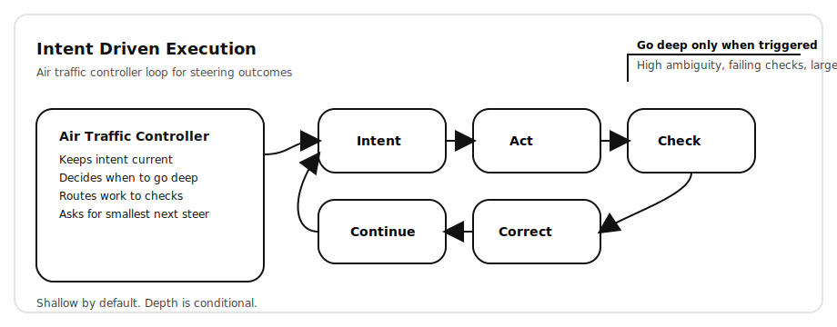

# Intent-Driven Execution  
### A simple way to build with AI without recreating process overhead

AI has made execution cheap.

We can generate code, designs, plans, and prototypes faster than teams can decide what they actually want. Iteration is fast. Exploration is easy.

What hasn’t scaled is **decision-making**.

The mistake many teams are making is trying to scale AI work using **human process**: specs, PRDs, agile pods, agent hierarchies. That structure feels safe, but it quietly reintroduces the very overhead AI was supposed to remove.

Intent-Driven Execution starts from a different belief.

> As execution gets cheaper, steering becomes the real work.

---

## TL;DR

> **TL;DR**  
> Intent-Driven Execution replaces heavy specs and agent “pods” with tight steering loops.  
> You act early, correct often, and only go deep when ambiguity or risk shows up.  
> Think of it like an **air traffic controller for work**: guiding many paths safely without over-coordinating.

---

## The shift

Traditional workflows try to create clarity **before** work begins.

Intent-Driven Execution assumes clarity is something you **discover through action**, not define upfront.

You act early.  
You look at real output.  
You correct direction quickly.  
You repeat until uncertainty drops.

This feels less like agile engineering and more like design iteration.

---

## How it works (without the ceremony)

Everything starts with **intent**, not a spec.

Intent is a short, living statement of:
- what you’re trying to achieve  
- what matters most  
- what’s explicitly out of scope  

Intent is allowed to change as the team learns.

From there, work runs in a tight loop:

**Intent → Act → Check → Correct → Continue**

The system produces something concrete, checks it against reality, reports confidence and uncertainty, asks for the smallest possible steer, and continues.

There’s no long planning phase.  
There’s no rigid handoff.  
Progress comes from frequent correction, not prediction.

---

## A quick walkthrough

Imagine you’re building a pricing rules engine.

You start with intent:

> Support experimentation.  
> Correctness matters more than performance.  
> Avoid locking into a single pricing model.

The system acts quickly. It sketches a simple approach and highlights assumptions it’s making.

You review it and realize the abstraction is too rigid. You steer:

> We’ll want to swap strategies later. Bias toward composability.

Now the system slows down. It reasons more deeply, proposes alternatives, and surfaces tradeoffs.

You choose a direction. It implements. Tests pass. Uncertainty drops.

A short decision note is captured:

> Chose composable rule functions to preserve flexibility.

No PRD.  
No sprint planning.  
No agent standups.

Just steering.

---

## What makes this different

Intent-Driven Execution explicitly rejects the idea that AI work should mirror human org structures.

It assumes:
- coordination is cheap until it isn’t  
- depth should be earned, not assumed  
- clarity emerges from interaction, not documentation  

The system does **not** reason deeply by default.  
It escalates depth only when ambiguity, risk, or disagreement appears.

Every meaningful output separates:
- what it’s confident about  
- what it’s guessing  

Decision history is captured lightly, so intent doesn’t disappear, without turning into process theater.

This is not hands-off automation.  
It’s **high-frequency collaboration**.

---

## When this works best

This approach shines when:
- the problem space is evolving  
- speed of learning matters more than perfect planning  
- AI agents are doing meaningful work  
- you want fewer meetings and faster convergence  

It is not designed for compliance-heavy or highly regulated workflows.

---

## Why this matters now

AI has compressed execution time faster than most teams have adapted their decision-making habits.

The result is faster output, but not faster convergence.

Intent-Driven Execution is a way to:
- keep humans in control as systems move faster  
- avoid scaling process alongside automation  
- preserve product judgment under speed  

---

## The bet

The teams that win won’t be the ones with the most agents or the most structure.

They’ll be the ones who learn how to **steer systems effectively**.

---

## How to pilot this

This is meant to be tested, not debated. Run a 2-week pilot with a small team and a real deliverable.

### Pick the right pilot
Choose a project that is:
- meaningful but not mission-critical  
- easy to validate (tests, UI behavior, output quality)  
- likely to evolve (some ambiguity is good)  

Avoid compliance-heavy or high-risk systems for the first run.

### Team + roles (small on purpose)
- 1 engineer (driver)  
- 1 product partner (steering + acceptance)  
- optional: 1 designer (if UI-heavy)  
- optional: 1 reviewer (final sanity)

### Setup (30 minutes)
Create two files in the repo:
- `intent.md` — the living intent statement  
- `decisions.md` — short decision snapshots  

Recommended structure for `intent.md`:
- Goal  
- Constraints  
- Non-goals  
- Priority  
- Acceptance  

### Run the loop (daily)
Operate in tight cycles:

**Intent → Act → Check → Correct → Continue**

Rules of thumb:
- start shallow with small changes and early output  
- run real checks (tests, lint, build, UI preview)  
- after each loop, capture:
  - what changed  
  - what’s confident vs uncertain  
  - the smallest next steering question  

### When to go deep
Escalate reasoning only when:
- tests fail or behavior is unclear  
- large diffs or risky refactors appear  
- multiple approaches compete  
- uncertainty stays high across multiple loops  

### Decision snapshots
Only write a decision when something meaningful changes:
- “We chose X because Y”  
- “We rejected Z because W”  
- “Assumption: A”  

Keep it short and append-only.

### What to measure
At the end of 2 weeks, review:
- time to first usable output  
- number of loops to converge  
- rework or reversals  
- where the team got stuck  
- rough token or cost impact  
- team sentiment: “more clarity or more chaos?”

### Success looks like
- faster convergence with fewer meetings  
- earlier detection of wrong paths  
- fewer heavy specs without losing clarity  
- durable decisions captured without ceremony
